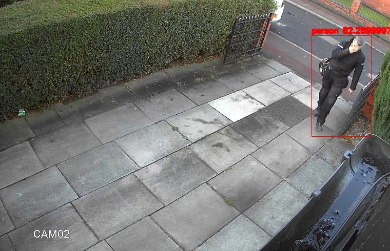

# Ai system for CCTV

## Python modules

Create a virtualenv for the project:

```bash
python3 -m venv env
source env/bin/activate
```

Then you need to install the pip modules to execute the scripts:

```bash
pip install -r requirements.txt
```

Edit the *config/config.ini* file to add the path of the folder you want to watch and the optional telegram token for the notification:

```bash
cp scripts/config/config.ini.sample scripts/config/config.ini
```

Execute the script to watch the folder:

```bash
cd scripts
python3 main.py
```

Sample output:


## Prerequisites

In order to scan the images for people, you need to have an object detection model available. There are adaptors in the `scripts/models` directory. Check those files if you want to use a different model. I'm using the caffe implementation of [MobileSSD](https://github.com/chuanqi305/MobileNet-SSD) for detections in the daylight, and [YOLO](https://pjreddie.com/darknet/yolo/).

## M1 Macbook

```
Python 3.8.10
mysql  Ver 8.0.23 for osx10.16 on x86_64 (Homebrew)
```

Create user "cctv" identified by "password"

```
mysql -uroot
CREATE USER 'cctv'@'localhost' IDENTIFIED BY 'password';
GRANT ALL PRIVILEGES ON * . * TO 'cctv'@'localhost';
ALTER USER 'cctv'@'localhost' IDENTIFIED BY 'password' PASSWORD EXPIRE NEVER;
ALTER USER 'cctv'@'localhost' IDENTIFIED WITH mysql_native_password BY 'password';

```

```bash
# Install python 3.8
arch -x86_64 arm brew install python@3.8
# Add python3.8 to $PATH
export PATH="/usr/local/opt/python@3.8/bin:$PATH"
# Create virtualenv
virtualenv --python=python3.8 env
pip3 install -r requirements.txt
cd scripts && python3.8 main.py
```

Drop a video file (moto.h264) in the folder `SourcePath=/Users/gabri/code/cctv/video/cctv/02/rec` to activate the recognition.
You can set the first part of the path in the config file.
